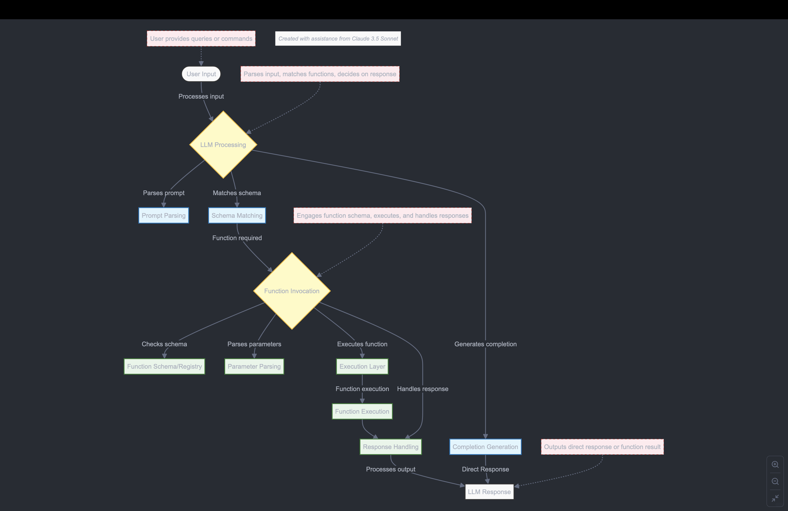

# Exploring function calling 🗣️ 🤖 with Python and ollama 🦙
Function-calling with Python and ollama. We are going to use the Africa's Talking API to send airtime and messages to a phone number using Natural language. Thus, creating an generative ai agent. Here are examples of prompts you can use to send airtime to a phone number:
- Send airtime to xxxxxxxxx2046 and xxxxxxxxx3524 with an amount of 10 in currency KES
- Send a message to xxxxxxxxx2046 and xxxxxxxxx3524 with a message "Hello, how are you?", using the username "username".

NB: The phone numbers are placeholders for the actual phone numbers.
You need some VRAM to run this project. You can get VRAM from [here](https://vast.ai/)
We recommend 400MB-8GB of VRAM for this project. It can run on CPU however, I recommend smaller models for this.   

[Mistral 7B](https://ollama.com/library/mistral), **llama 3.2 3B/1B**, [**Qwen 2.5: 0.5/1.5B**](https://ollama.com/library/qwen2.5:1.5b), [nemotron-mini 4b](https://ollama.com/library/nemotron-mini) and [llama3.1 8B](https://ollama.com/library/llama3.1) are the recommended models for this project.    

Ensure ollama is installed on your laptop/server and running before running this project. You can install ollama from [here](ollama.com)   
Learn more about tool calling <https://gorilla.cs.berkeley.edu/leaderboard.html>


## Table of contents
- [File structure](#file-structure)
- [Installation](#installation)
- [Run in Docker](#run-in-docker)
- [Usage](#usage)
- [Use cases](#use-cases)
- [Contributing](#contributing)
- [License](#license)    


## File structure
.   
├── Dockerfile.app - template to run the gradio dashboard.   
├── Dockerfile.ollama - template to run the ollama server.       
├── docker-compose.yml - use the ollama project and gradio dashboard.   
├── docker-compose-codecarbon.yml - use the codecarbon project, ollama and gradio dashboard.   
├── .env - This file contains the environment variables for the project. (Not included in the repository)   
├── app.py - the function_call.py using gradio as the User Interface.    
├── Makefile - This file contains the commands to run the project.   
├── README.md - This file contains the project documentation. This is the file you are currently reading.       
├── requirements.txt - This file contains the dependencies for the project.  
├── summary.png - How function calling works with a diagram.   
└── utils - This directory contains the utility files for the project.      
    ├── __init__.py - This file initializes the utils directory as a package.    
    ├── function_call.py - This file contains the code to call a function using LLMs.       
    └── communication_apis.py - This file contains the code to do with communication apis & experiments.          
    
## Installation
The project uses python 3.12. To install the project, follow the steps below:    

- Clone the repository
```bash
git clone
```
- Change directory to the project directory
```bash
cd tool_calling_api
```   
Create a virtual environment
```bash
python3 -m venv venv
```
Activate the virtual environment
```bash
source venv/bin/activate
```
Confirm if steps of Makefile are working
```bash
make -n
```

- Install the dependencies
```bash
make install
```
- Run the project

```bash
make run
```
Long way to run the project   

- Change directory to the utils directory
```bash
cd utils
```
- Run the function_call.py file
```bash
python function_call.py
```
- Run the Gradion UI instead
```bash
python ../app.py
```

## Run in Docker
To run the project in Docker, follow the steps below:

NB: You'll need to have deployed ollama elsewhere as an example [here](https://vast.ai/) or [here](https://runpod.io/). Make edits to the app.py file to point to the ollama server. You can use the OpenAI SDK to interact with the ollama server. An example can be found [here](https://github.com/pooyahrtn/RunpodOllama).

- Linting dockerfile

```bash
make docker_run_test
```

- Build and run the Docker image

```bash
make docker_run
```

Notes:
-  The .env file contains the environment variables for the project. You can create a .env file and add the following environment variables: 

```bash
echo "AT_API_KEY = yourapikey" >> .env
echo "AT_USERNAME = yourusername" >> .env
```
- The Dockerfile creates 2 images for the ollama server and the gradio dashboard. The ollama server is running on port 8000 and the gradio dashboard is running on port 7860 . You can access the gradio dashboard by visiting <http://localhost:7860> in your browser & the ollama server by visiting <http://localhost:11434> in your browser. They consume about 2.72GB of RAM.     
- The docker-compose.yml file is used to run the ollama server and the gradio dashboard. The docker-compose-codecarbon.yml file is used to run the ollama server, the gradio dashboard and the codecarbon project.   


## Run in runpod.io
Make an account if you haven't already. Once that's settled.    

- Click on Deploy under Pods.   
- Select the cheapest option pod to deploy for example RTX 2000 Ada.    
- This will create a jupyter lab instance.   
- Follow the Installation steps in the terminal available. Until the make install.    
- Run this command. Install ollama and serve it then redirect output to a log file.    

```bash
curl -fsSL https://ollama.com/install.sh | sh && ollama serve > ollama.log 2>&1 &
```
- Install your preferred model in the same terminal.     

```bash
ollama run qwen2.5:0.5b
```
- Export your credentials but, if you are using a .env file, you can skip this step. It will be useful for Docker.   

```bash
export AT_API_KEY=yourapikey
export AT_USERNAME=yourusername
```
- Continue running the installation steps in the terminal.    
- Send your first message and airtime with an LLM. 🌠     

Read more about setting up ollama and serveless options <https://blog.runpod.io/run-llama-3-1-405b-with-ollama-a-step-by-step-guide/> & <https://blog.runpod.io/run-llama-3-1-with-vllm-on-runpod-serverless/>    

## Usage
This project uses LLMs to send airtime to a phone number. The difference is that we are going to use the Africa's Talking API to send airtime to a phone number using Natural language. Here are examples of prompts you can use to send airtime to a phone number:    
- Send airtime to xxxxxxxxxx046 and xxxxxxxxxx524 with an amount of 10 in currency KES.   
- Send a message to xxxxxxxxxx046 and xxxxxxxxxx524 with a message "Hello, how are you?", using the username "username".



## Use cases
    * Non-Technical User Interfaces: Simplifies the process for non-coders to interact with APIs, making it easier for them to send airtime and messages without needing to understand the underlying code.    
    * Customer Support Automation: Enables customer support teams to quickly send airtime or messages to clients using natural language commands, improving efficiency and response times.    
    * Marketing Campaigns: Facilitates the automation of promotional messages and airtime rewards to customers, enhancing engagement and retention.    
    * Emergency Notifications: Allows rapid dissemination of urgent alerts and notifications to a large number of recipients using simple prompts.    
    * Educational Tools: Provides a practical example for teaching how to integrate APIs with natural language processing, which can be beneficial for coding bootcamps and workshops.    

## Contributing
Contributions are welcome. If you would like to contribute to the project, you can fork the repository, create a new branch, make your changes and then create a pull request.

## License
[License information](https://github.com/Shuyib/tool_calling_api/blob/main/LICENSE).
