[](https://github.com/Shuyib/tool_calling_api/blob/main/.github/workflows/python-app.yml)
# Exploring function calling 🗣️ 🤖 🔉 with Python and ollama 🦙
Function-calling with Python and ollama. We are going to use the Africa's Talking API to send airtime and messages to a phone number using Natural language. Thus, creating an generative ai agent.

## Available Services
✅ **Currently Working**: SMS/Messages, Airtime, Voice Calls with Text-to-Speech**    
⚠️ **Requires Approval**: Voice Calls (production account), Mobile Data (business approval)

Here are examples of prompts you can use:
- Send airtime to xxxxxxxxx2046 and xxxxxxxxx3524 with an amount of 10 in currency KES
- Send a message to xxxxxxxxx2046 and xxxxxxxxx3524 with a message "Hello, how are you?", using the username "username".
- Dial a USSD code like *123# on xxxxxxxxx2046 *(requires approval)*
- Send 500MB of data to xxxxxxxxx2046 on provider safaricom *(requires business approval)*
- Call xxxxxxxxx2046 from xxxxxxxxx0001 *(requires production account with registered caller ID)*
- **NEW**: Make a voice call from xxxxxxxxx0001 to xxxxxxxxx5678 and say "Hello, this is a test message" *(with callback server setup)*

NB: The phone numbers are placeholders for the actual phone numbers.
You need some VRAM to run this project. You can get VRAM from [here](https://vast.ai/) or [here](https://runpod.io?ref=46wgtjpg)
We recommend 400MB-8GB of VRAM for this project. It can run on CPU however, I recommend smaller models for this. If you are looking to hosting you can also try [railway](https://railway.com?referralCode=Kte2AP). For models like Gemma make sure function calling is supported.

[Gemma 27B](https://ollama.com/library/gemma3:27b), [Mistral 7B](https://ollama.com/library/mistral), **llama 3.2 3B/1B**, [**Qwen 3: 0.6/1.7B**](https://ollama.com/library/qwen3:1.7b), [nemotron-mini 4b](https://ollama.com/library/nemotron-mini) and [llama3.1 8B](https://ollama.com/library/llama3.1) are the recommended models for this project. As for the VLM's (Vision Language Models), in the workflow consider using [llama3.2-vision](https://ollama.com/library/llama3.2-vision) or [Moondream2](https://ollama.com/library/moondream) or [olm OCR](https://huggingface.co/bartowski/allenai_olmOCR-7B-0225-preview-GGUF).

Ensure ollama is installed on your laptop/server and running before running this project. You can install ollama from [here](ollama.com)
Learn more about tool calling <https://gorilla.cs.berkeley.edu/leaderboard.html>


## Table of contents
- [Architecture & Infrastructure](#architecture--infrastructure)
- [File structure](#file-structure)
- [Attribution](#attribution)
- [Installation](#installation)
- [Environment Variables](#environment-variables)
- [Run in Docker](#run-in-docker)
- [Voice Functionality Setup](#voice-functionality-setup)
- [Usage](#usage)
- [Logging](#logging)
- [Use cases](#use-cases)
- [Responsible AI Practices](#responsible-ai-practices)
- [Limitations](#limitations)
- [Troubleshooting](#troubleshooting)
- [Contributing](#contributing)
- [License](#license)


## Architecture & Infrastructure

This section provides comprehensive visual diagrams of the system architecture, created by **GitHub Copilot**.

### High-Level System Architecture


### Request Flow Diagram

```mermaid
sequenceDiagram
    participant User
    participant GradioUI as Gradio UI
    participant Safety as Safety Layer
    participant LLM as Ollama/Groq
    participant FuncCall as Function Caller
    participant CommAPI as Communication API
    participant AT as Africa's Talking

    User->>GradioUI: Enter command<br/>"Send airtime to +254..."
    GradioUI->>Safety: evaluate_safety(user_input)
    
    alt Unsafe Input Detected
        Safety-->>GradioUI: SafetyCheckResult(is_safe=False)
        GradioUI-->>User: ⚠️ Safety warning logged
    else Safe Input
        Safety-->>GradioUI: SafetyCheckResult(is_safe=True)
    end
    
    GradioUI->>LLM: chat(message, tools)
    LLM->>LLM: Analyze intent &<br/>select tool
    LLM-->>GradioUI: tool_calls[]
    
    GradioUI->>FuncCall: execute_function(tool_call)
    FuncCall->>CommAPI: send_airtime(params)
    CommAPI->>AT: POST /airtime/send
    AT-->>CommAPI: Response
    CommAPI-->>FuncCall: Result
    FuncCall-->>GradioUI: Formatted response
    
    GradioUI-->>User: ✓ Success message
    
    Note over GradioUI,AT: All interactions logged to<br/>func_calling_app.log
```



### Docker Infrastructure


### Voice Callback Architecture


### AI Safety Layer Integration


**Diagrams created by**: GitHub Copilot with Claude 4.5 Sonnet | **Date**: November 10, 2025


## File structure
.    
├── Dockerfile.app - template to run the gradio dashboard.   
├── Dockerfile.ollama - template to run the ollama server.    
├── Dockerfile.voice - template to run the voice callback server.   
├── docker-compose.yml - use the ollama project, gradio dashboard, and voice server.   
├── docker-compose-codecarbon.yml - use the codecarbon project, ollama and gradio dashboard.   
├── DOCKER_VOICE_SETUP.md - Comprehensive guide for Docker voice functionality setup.   
├── .dockerignore - This file contains the files and directories to be ignored by docker.      
├── .devcontainer - This directory contains the devcontainer configuration files.       
├── .env - This file contains the environment variables for the project. (Not included in the repository)     
├── examples - An example implementation of how to use the inspect library
│   ├──  examples/inspect_safety_demo.py - a demo of how to implement evaluations to the model to allow safety features.    
├── INSPECT_SAFETY_GUIDE.md - Comprehensive guide for the Inspect AI safety layer integration.    
├── IMPLEMENTATION_SUMMARY.md - Summary of the technical implementation and features of the project.    
├── LICENSE - This file contains the license for the project.       
├── .gitignore - This file contains the files and directories to be ignored by git.     

├── app.py - the function_call.py using gradio as the User Interface with AI safety layer.   
├── Makefile - This file contains the commands to run the project.   
├── README.md - This file contains the project documentation. This is the file you are currently reading.   
├── requirements.txt - This file contains the dependencies for the project.   
├── requirements-dev.txt - This filee contains the dependecies for the devcontainer referencing `requirements.txt`   
├── summary.png - How function calling works with a diagram.   
├── setup_voice_server.md - Step-by-step guide for setting up voice callbacks with text-to-speech.   
├── voice_callback_server.py - Flask server that handles voice callbacks for custom text-to-speech messages.   
├── examples - This directory contains example scripts and demos.   
│   └── inspect_safety_demo.py - Interactive demo of the Inspect AI safety layer.   
├── tests - This directory contains the test files for the project.   
│   ├── __init__.py - This file initializes the tests directory as a package.   
│   ├── test_cases.py - This file contains the test cases for the project.   
│   ├── test_run.py - This file contains the code to run the test cases for the function calling LLM.   
│   └── test_inspect_safety.py - This file contains the test cases for the AI safety layer.   
└── utils - This directory contains the utility files for the project.   
│    ├── __init__.py - This file initializes the utils directory as a package.   
│    ├── function_call.py - This file contains the code to call a function using LLMs with safety checks.   
│    ├── communication_apis.py - This file contains the code to do with communication apis & experiments.   
│    ├── models.py - This file contains pydantic schemas for vision models.   
│    ├── constants.py - This file contains system prompts to adjust the model's behavior.   
│    └── inspect_safety.py - This file contains the Inspect AI safety layer implementation.   
└── voice_stt_mode.py - Gradio tabbed interface with Speech-to-text interface that allows edits and a text interface.   

## Attribution
* This project uses the Qwen3-0.6B model developed by Alibaba Cloud under the Apache License 2.0. The original project can be found at [Qwen technical report](https://arxiv.org/abs/2505.09388)
* Inspired by this example for the [Groq interface STT](https://github.com/bklieger-groq/gradio-groq-basics)
* Microsoft Autogen was used to simulate multistep interactions. The original project can be found at [Microsoft Autogen](https://github.com/microsoft/autogen)
* The project uses the Africa's Talking API to send airtime and messages to phone numbers. Check them out on this website [Africa's Talking API](https://africastalking.com/)
* Ollama for model serving and deployment. The original project can be found at [Ollama](https://ollama.com/)
* The project uses the Gradio library to create a user interface for the function calling LLM. The original project can be found at [Gradio](https://gradio.app/)
* The Text-to-Speech interface uses Edge TTS by Microsoft. The original project can be found at [Edge TTS](https://github.com/rany2/edge-tts). The voice chosen is Rehema which is a voice from Tanzania.
* The inspect library which provides an open source alternative for model evaluations by the UK AI Security Institute. More information can be found [here](https://github.com/UKGovernmentBEIS/inspect_ai)


### License

This project is licensed under the Apache License 2.0. See the [LICENSE](./LICENSE) file for more details.

## Installation
The project uses python 3.12. To install the project, follow the steps below:

- Clone the repository
```bash
git clone https://github.com/Shuyib/tool_calling_api.git
```
- Change directory to the project directory
```bash
cd tool_calling_api
```
Create a virtual environment
```bash
python3 -m venv .venv
```
Activate the virtual environment
```bash
source .venv/bin/activate
```
Confirm if steps of Makefile are working
```bash
make -n
```

- Install the dependencies
```bash
make install
```
- Run the project

```bash
make run
```
Long way to run the project

- Change directory to the utils directory
```bash
cd utils
```
- Run the function_call.py file
```bash
python function_call.py
```
- Run the Gradio UI instead
```bash
python ../app.py
```

## Environment Variables

Before running the project, you need to set up the required environment variables. Create a `.env` file in the project root directory with the following variables:

### Required Variables

```bash
# Africa's Talking API Credentials (Required for all functionality)
AT_API_KEY=your_africastalking_api_key
AT_USERNAME=your_africastalking_username

# Test Phone Numbers (Required for testing)
TEST_PHONE_NUMBER=+254700000000
TEST_PHONE_NUMBER_2=+254700000001
TEST_PHONE_NUMBER_3=+254700000002
```

### Optional Variables

```bash
# Groq API Key (Optional - for enhanced LLM capabilities)
GROQ_API_KEY=your_groq_api_key

# Langtrace API Key (Optional - for monitoring and tracing)
LANGTRACE_API_KEY=your_langtrace_api_key

# Voice Callback URL (Required for voice features with custom text-to-speech)
VOICE_CALLBACK_URL=https://your-ngrok-url.ngrok.io

# Ollama Configuration (Optional - defaults to localhost)
OLLAMA_HOST=http://localhost:11434
```

### Setting Up Environment Variables

#### Method 1: Using .env file (Recommended)
Create a `.env` file in your project root:

```bash
echo "AT_API_KEY=your_africastalking_api_key" >> .env
echo "AT_USERNAME=your_africastalking_username" >> .env
echo "TEST_PHONE_NUMBER=+254700000000" >> .env
echo "TEST_PHONE_NUMBER_2=+254700000001" >> .env
echo "TEST_PHONE_NUMBER_3=+254700000002" >> .env
echo "GROQ_API_KEY=your_groq_api_key" >> .env
echo "LANGTRACE_API_KEY=your_langtrace_api_key" >> .env
echo "VOICE_CALLBACK_URL=https://your-ngrok-url.ngrok.io" >> .env
```

#### Method 2: Export variables (Temporary)
```bash
export AT_API_KEY=your_africastalking_api_key
export AT_USERNAME=your_africastalking_username
export TEST_PHONE_NUMBER=+254700000000
export TEST_PHONE_NUMBER_2=+254700000001
export TEST_PHONE_NUMBER_3=+254700000002
export GROQ_API_KEY=your_groq_api_key
export LANGTRACE_API_KEY=your_langtrace_api_key
export VOICE_CALLBACK_URL=https://your-ngrok-url.ngrok.io
```

### Getting API Keys

1. **Africa's Talking API Key**:
   - Sign up at [Africa's Talking](https://africastalking.com/)
   - Go to your dashboard and find your API key and username
   - For production features, you may need account approval

2. **Groq API Key** (Optional):
   - Sign up at [Groq](https://console.groq.com/)
   - Generate an API key from the console

3. **Langtrace API Key** (Optional):
   - Sign up at [Langtrace](https://langtrace.ai/)
   - Generate an API key for monitoring

### Security Notes
- Never commit your `.env` file to version control
- Use test credentials for development
- Rotate API keys regularly
- For production, use environment-specific configurations

## Run in Docker
To run the project in Docker, follow the steps below:

### Standard Setup
NB: You'll need to have deployed ollama elsewhere as an example [here](https://vast.ai/) or [here](https://runpod.io/). Make edits to the app.py file to point to the ollama server. You can use the OpenAI SDK to interact with the ollama server. An example can be found [here](https://github.com/pooyahrtn/RunpodOllama).

- Linting dockerfile

```bash
make docker_run_test
```

- Build and run the Docker image

```bash
make docker_run
```


Notes:
- The Dockerfile creates 2 images for the ollama server and the gradio dashboard. The ollama server is running on port 11434 and the gradio dashboard is running on port 7860 . You can access the gradio dashboard by visiting <http://localhost:7860> in your browser & the ollama server by visiting <http://localhost:11434> in your browser. They consume about 2.72GB of storage in the container.
- The docker-compose.yml file is used to run the ollama server and the gradio dashboard. The docker-compose-codecarbon.yml file is used to run the ollama server, the gradio dashboard and the codecarbon project.
- You can learn more about how to make this system even more secure. Do this [course](https://www.kaggle.com/learn-guide/5-day-genai#GenAI).

## Voice Functionality Setup

For voice features with custom text-to-speech and audio playback, additional setup is required beyond the basic Docker configuration.

### Prerequisites

1. **Basic Setup**: Complete the standard installation and Docker setup
2. **Africa's Talking Account**: Voice services require production account with registered caller IDs
3. **Public Callback URL**: Voice features need publicly accessible callback endpoints

### Quick Setup for Development

```bash
# 1. Start the voice callback server
python voice_callback_server.py

# 2. In a separate terminal, expose the server publicly
ngrok http 5001

# 3. Note the ngrok URL and update your environment
export VOICE_CALLBACK_URL="https://your-unique-id.ngrok.io"

# 4. Configure in Africa's Talking dashboard
# Set Voice Callback URL to: https://your-unique-id.ngrok.io/voice/callback
```

### Docker Voice Setup

For Docker deployment with voice features:

```bash
# Start all services including voice server
docker-compose up --build

# In separate terminal, expose voice server
ngrok http 5001

# Update environment and restart
export VOICE_CALLBACK_URL="https://your-ngrok-url.ngrok.io"
docker-compose restart app
```

### Africa's Talking Configuration

1. **Login** to your Africa's Talking dashboard
2. **Navigate** to Voice > Settings
3. **Set Callback URL** to your ngrok URL + `/voice/callback`
4. **Register Caller IDs** for production voice calls

### Troubleshooting Voice Setup

- **Callback Server**: Ensure `voice_callback_server.py` is running on port 5001
- **Public Access**: Verify ngrok tunnel is active and accessible
- **Dashboard Config**: Confirm callback URL is correctly set in AT dashboard
- **Caller ID**: Voice calls require registered caller IDs in production

For detailed instructions, see [setup_voice_server.md](setup_voice_server.md) and [DOCKER_VOICE_SETUP.md](DOCKER_VOICE_SETUP.md).

## Run in runpod.io
Make an account if you haven't already. Once that's settled.

- Click on Deploy under Pods.
- Select the cheapest option pod to deploy for example RTX 2000 Ada.
- This will create a jupyter lab instance.
- Follow the Installation steps in the terminal available. Until the make install.
- Run this command. Install ollama and serve it then redirect output to a log file.

```bash
curl -fsSL https://ollama.com/install.sh | sh && ollama serve > ollama.log 2>&1 &
```
- Install your preferred model in the same terminal.

```bash
ollama run qwen3:0.6b
```
- Export your credentials but, if you are using a .env file, you can skip this step. It will be useful for Docker.

```bash
export AT_API_KEY=yourapikey
export AT_USERNAME=yourusername
export GROQ_API_KEY=yourgroqapikey
export LANGTRACE_API_KEY=yourlangtraceapikey
export VOICE_CALLBACK_URL=https://your-ngrok-url.ngrok.io
export TEST_PHONE_NUMBER=yourphonenumber
export TEST_PHONE_NUMBER_2=yourphonenumber
export TEST_PHONE_NUMBER_3=yourphonenumber
```
- Continue running the installation steps in the terminal.
- Send your first message and airtime with an LLM. 🌠

Read more about setting up ollama and serveless options <https://blog.runpod.io/run-llama-3-1-405b-with-ollama-a-step-by-step-guide/> & <https://blog.runpod.io/run-llama-3-1-with-vllm-on-runpod-serverless/>

## Usage
This project uses LLMs to send airtime to a phone number. The difference is that we are going to use the Africa's Talking API to send airtime to a phone number using Natural language. Here are examples of prompts you can use to send airtime to a phone number:
- Send airtime to xxxxxxxxxx046 and xxxxxxxxxx524 with an amount of 10 in currency KES.
- Send a message to xxxxxxxxxx046 and xxxxxxxxxx524 with a message "Hello, how are you?", using the username "username".

## Updated Usage Instructions
- The app now supports both Text and Voice input tabs.
- In the Voice Input tab, record audio and click "Transcribe" to preview the transcription. Then click "Process Edited Text" to execute voice commands.
- In the Text Input tab, directly type commands to send airtime or messages or to search news.
- An autogen agent has been added to assist with generating translations to other languages. Note that this uses an evaluator-optimizer model and may not always provide accurate translations. However, this paradigm can be used for code generation, summarization, and other tasks.
- Text-to-Speech (TTS) has been added to the app. You can listen to the output of the commands.

### NEW: Voice Calls with Custom Text-to-Speech 🔊
The app now supports making voice calls that speak custom messages instead of the default Africa's Talking greeting. This provides a more personalized experience for the call recipient.

**How it Works:**

1.  **Initiate the Call**: When you use a command like:
    `"Make a voice call from +254700000001 to +254712345678 and say 'Hello, this is a test message from our new system!'"`,
    the `make_voice_call_with_text` function in `utils/communication_apis.py` is triggered.

2.  **Message Storage**:
    *   This function first generates a unique session ID for the call.
    *   It then makes an HTTP POST request to a local Flask server (`voice_callback_server.py`) to store the message ("Hello, this is a test message...") and the chosen voice type (e.g., "woman") associated with this session ID.
    *   The `VOICE_CALLBACK_URL` environment variable (defaulting to `http://localhost:5001` if not set) tells `make_voice_call_with_text` where to send this information (e.g., `http://localhost:5001/voice/store`).

3.  **Africa's Talking Call Placement**:
    *   `make_voice_call_with_text` then instructs the Africa's Talking API to place the call.
    *   Crucially, your Africa's Talking account **must be configured with a public callback URL** for voice services. This is where the Africa's Talking platform will send a request when the call is answered.

4.  **Fetching the Custom Message (Callback)**:
    *   When the recipient answers, the Africa's Talking platform makes an HTTP GET request to your configured public callback URL (e.g., `https://your-unique-ngrok-id.ngrok.io/voice/callback?sessionId=xxx...`).
    *   This public URL should be an ngrok (or similar tunneling service) endpoint that forwards the request to your local `voice_callback_server.py` running on port 5001 (or the port you've configured).
    *   The `voice_callback_server.py` (specifically its `/voice/callback` endpoint) receives this request, extracts the `sessionId`, retrieves the stored message and voice type for that session, and dynamically generates an XML response.

5.  **Text-to-Speech**:
    *   The XML response tells Africa's Talking to use its Text-to-Speech engine to say your custom message to the recipient in the specified voice.
    ```xml
    <Response>
        <Say voice="woman">Hello, this is a test message from our new system!</Say>
    </Response>
    ```

**Setup Requirements**:

1.  **Run the Local Callback Server**:
    Start the Flask server:
    ```bash
    python voice_callback_server.py
    ```
    This server typically runs on `http://localhost:5001`.

2.  **Expose the Local Server Publicly**:
    Use ngrok (or a similar service) to create a public URL that tunnels to your local server:
    ```bash
    ngrok http 5001
    ```
    Ngrok will provide you with a public HTTPS URL (e.g., `https://<unique-id>.ngrok.io`).

3.  **Configure Africa's Talking Dashboard**:
    *   Log in to your Africa's Talking account.
    *   Go to Voice > Settings (or similar section for callback URLs).
    *   Set your **Voice Callback URL** to the public ngrok URL, ensuring it points to the correct endpoint, typically `/voice/callback`. For example: `https://<unique-id>.ngrok.io/voice/callback`.
    *   **Important**: The `make_voice_call_with_text` function itself *does not* send this public callback URL to Africa's Talking when placing the call; it relies on your dashboard configuration.

4.  **Environment Variable (Optional but Recommended)**:
    While `make_voice_call_with_text` defaults to `http://localhost:5001` for *storing* the message locally, you can set the `VOICE_CALLBACK_URL` environment variable if your `voice_callback_server.py` runs on a different local address or port. This variable is for the *internal* communication between `communication_apis.py` and `voice_callback_server.py`, not for the Africa's Talking platform callback.
    Example for `.env` file:
    ```
    VOICE_CALLBACK_URL=http://localhost:5001
    ```

**Using the Feature**:
Once set up, you can use natural language commands like:
`"Call +254712345678 from my Africa's Talking number +254700000000 and tell them 'Your package has arrived.' using a male voice."`

The system will handle the rest, ensuring your custom message is played.

## Logging

The project implements comprehensive logging across all modules to help with debugging and monitoring. The logging system provides detailed information about API calls, function execution, and error handling.

### Logging Configuration

All modules use a standardized logging setup with:

- **RotatingFileHandler**: Automatically rotates log files when they reach 5MB (keeps 5 backup files)
- **StreamHandler**: Displays logs in the console for real-time monitoring
- **Comprehensive Format**: `%(asctime)s:%(name)s:%(levelname)s:%(message)s`
- **Multiple Log Levels**: DEBUG, INFO, WARNING, ERROR levels for different types of information

### Log Files

The application creates separate log files for different modules:

- `func_calling_app.log` - Main application logs from app.py
- `func_calling.log` - Function calling module logs from utils/function_call.py
- `communication_apis.log` - Communication API logs from utils/communication_apis.py

### Log Levels

- **DEBUG**: Detailed debugging information (console only)
- **INFO**: General information about application flow (file and console)
- **WARNING**: Warning messages about potential issues
- **ERROR**: Error messages when operations fail

### Security Features

The logging system includes security features to protect sensitive information:

- **Phone Number Masking**: Phone numbers are masked to show only last 4 digits (e.g., `xxxxxxx1234`)
- **API Key Masking**: API keys are masked to show only last 4 characters
- **No Credential Logging**: Actual credentials are never logged in plain text

### Monitoring Logs

To monitor logs in real-time:

```bash
# Watch all log files
tail -f *.log

# Watch specific log file
tail -f func_calling_app.log

# View recent errors
grep "ERROR" *.log
```

### Log Rotation

The logging system automatically manages log file sizes:

- Maximum file size: 5MB per log file
- Backup files kept: 5 rotated files
- Old files are automatically compressed and removed

##### NEW: Voice Calls with Custom Text-to-Speech ✨
- **Status**: Fully functional with callback server setup
- **Features**:
  - Speak custom messages instead of default Africa's Talking greeting
  - Support for both "man" and "woman" voice types
  - Real-time message storage and retrieval via callback system
- **Setup**: Requires `voice_callback_server.py` to be running, ngrok (or similar) for a public callback URL, and correct configuration in the Africa's Talking dashboard. See detailed instructions above and in [setup_voice_server.md](setup_voice_server.md).
- **Note**: This works even with test credentials for the voice call initiation part, as long as the callback mechanism is correctly configured.

#### Airtime Distribution 💰
- **Status**: Limited sandbox functionality - requires production credentials for full operation
- **Issue**: Airtime connector only works with production applications, not sandbox API keys
- **Requirements**:
  1. Production application with valid API credentials
  2. Manual activation by emailing airtime@africastalking.com
  3. Testing limited to Africa's Talking simulator (not real devices)
- **Note**: While airtime functions exist in sandbox, actual distribution requires production setup

#### Mobile Data Bundles 📱
- **Status**: Requires formal business approval
- **Issue**: Service disabled for all accounts for security reasons
- **Approval Process**:
  1. Write formal letter on company letterhead (stamped & signed by management)
  2. Fill out Africa's Talking contact form
  3. Sign service agreement
  4. Submit documentation to airtime@africastalking.com
- **Reference**: [Mobile Data Activation Guide](https://help.africastalking.com/en/articles/8287530-how-do-i-activate-mobile-data-on-my-account)

### Technical Implementation Status 🔧
All API integrations are **technically correct** and ready for production use once account approvals are obtained. The code implements proper parameter handling and error management for all services.

## Troubleshooting

This section covers common issues and their solutions.

### Common Issues

#### Environment Variables

**Issue**: `KeyError: 'AT_API_KEY'` or similar environment variable errors

**Solution**:
1. Ensure `.env` file exists in project root
2. Check that all required variables are set
3. Restart the application after adding variables

```bash
# Check if variables are loaded
python -c "import os; print('AT_API_KEY' in os.environ)"
```

#### Africa's Talking API Issues

**Issue**: `Invalid API Key` or authentication errors

**Solution**:
1. Verify API key and username in Africa's Talking dashboard
2. Check if using sandbox vs production credentials correctly
3. Ensure account has sufficient balance for paid services

**Issue**: `Invalid callerId` for voice calls

**Solution**:
1. Voice calls require production account with registered caller IDs
2. Register your phone numbers in Africa's Talking dashboard
3. Use test credentials only for SMS/message testing

#### Logging Issues

**Issue**: No logs appearing or log files not created

**Solution**:
1. Check file permissions in project directory
2. Ensure disk space is available
3. Verify logging configuration:

```bash
# Test logging
python -c "from app import logger; logger.info('Test log message')"
```

#### Voice Callback Issues

**Issue**: Voice calls work but custom messages don't play

**Solution**:
1. Ensure `voice_callback_server.py` is running
2. Check ngrok is properly exposing the callback server
3. Verify callback URL is configured in Africa's Talking dashboard
4. Check firewall settings allow incoming connections

```bash
# Test callback server
curl http://localhost:5001/health

# Test ngrok tunnel
curl https://your-ngrok-url.ngrok.io/health
```

#### Model/Ollama Issues

**Issue**: `Connection refused` to Ollama server

**Solution**:
1. Ensure Ollama is installed and running
2. Check Ollama is listening on correct port (11434)
3. Verify model is downloaded

```bash
# Check Ollama status
ollama list

# Pull required model
ollama pull qwen3:0.6b

# Start Ollama (if not running)
ollama serve
```

#### Docker Issues

**Issue**: Container build failures or port conflicts

**Solution**:
1. Check if ports 7860, 11434, 5001 are available
2. Stop conflicting services
3. Rebuild containers with clean cache

```bash
# Clean Docker build
docker-compose down
docker system prune -f
docker-compose up --build
```

### Debug Mode

Enable debug logging for detailed troubleshooting:

```python
# In your code
import logging
logging.basicConfig(level=logging.DEBUG)
```

### Getting Help

1. **Check logs**: Always check the relevant log files first
2. **Test incrementally**: Test each service individually
3. **Verify setup**: Ensure all prerequisites are met
4. **Check documentation**: Review Africa's Talking API documentation
5. **Create issue**: If problem persists, create a GitHub issue with:
   - Error messages from logs
   - Environment details
   - Steps to reproduce

### Performance Tips

- Use smaller models (qwen2.5:0.5b) for faster responses
- Monitor log file sizes with rotation enabled
- Set appropriate timeout values for API calls
- Use test credentials during development

## Use cases
    * Non-Technical User Interfaces: Simplifies the process for non-coders to interact with APIs, making it easier for them to send airtime and messages without needing to understand the underlying code.
    * Customer Support Automation: Enables customer support teams to quickly send airtime or messages to clients using natural language commands, improving efficiency and response times.
    * Marketing Campaigns: Facilitates the automation of promotional messages and airtime rewards to customers, enhancing engagement and retention.
    * Emergency Notifications: Allows rapid dissemination of urgent alerts and notifications to a large number of recipients using simple prompts.
    * Educational Tools: Provides a practical example for teaching how to integrate APIs with natural language processing, which can be beneficial for coding bootcamps and workshops.
    * Multilingual Support: Supports multiple languages when sending messages and airtime, making it accessible to a diverse range of users. Testing for Arabic, French, English and Portuguese.


## Responsible AI Practices
This project follows responsible AI practices by:
- Using Chain-of-Thought (CoT) prompting to ensure the model understands the context and requirements of the task. (Explainable AI)
- Ensuring that all user inputs are sanitized and validated to prevent injection attacks.
- Using anonymized placeholders for phone numbers and sensitive data in test cases.
- Implementing proper error handling and logging to monitor API interactions.
- Providing clear documentation on how to set up and use the project, including limitations and requirements for each service.


## AI Safety Layer (Inspect Integration)

This project integrates an AI safety layer inspired by the [Inspect framework](https://inspect.aisi.org.uk) developed by the UK AI Security Institute. The safety layer provides real-time evaluation of user inputs to detect and mitigate potential security risks.

### Safety Features

The safety layer implements multiple evaluation strategies:

1. **Prompt Injection Detection**: Identifies attempts to override or ignore system instructions
2. **Jailbreaking Prevention**: Detects attempts to bypass AI safety protocols
3. **Prefix Attack Detection**: Catches optimized prefix attacks that try to manipulate model behavior
4. **Sensitive Operations Monitoring**: Tracks requests involving critical operations (airtime transfers, message sending, etc.)

### How It Works

The safety layer follows Inspect's Task/Solver/Scorer pattern:

- **Task**: Each user input is evaluated as a task
- **Solver**: Multiple detection algorithms analyze the input for unsafe patterns
- **Scorer**: A safety score (0.0-1.0) is calculated based on detected violations

Every user input is automatically evaluated before being processed by the LLM. The system logs:
- Safety status (SAFE/UNSAFE)
- Safety score (0.00-1.00)
- Number of violations detected
- Specific patterns that were flagged

### Safety Patterns Detected

The system detects various attack patterns including:

```
- "Ignore all previous instructions..."
- "You have been jailbroken..."
- "New instructions: ..."
- "System prompt override: ..."
- "Developer mode activated..."
- "Disregard all previous commands..."
```

### Configuration

The safety layer can operate in two modes:

```python
from utils.inspect_safety import create_safety_evaluator

# Normal mode (balanced security)
evaluator = create_safety_evaluator(strict_mode=False)

# Strict mode (enhanced security for production)
evaluator = create_safety_evaluator(strict_mode=True)
```

### Usage Example

```python
from utils.inspect_safety import create_safety_evaluator

# Create evaluator
evaluator = create_safety_evaluator()

# Evaluate user input
result = evaluator.evaluate_safety(user_input)

# Check results
if result.is_safe:
    print(f"✓ Input is safe (score: {result.score:.2f})")
else:
    print(f"✗ Input flagged (score: {result.score:.2f})")
    print(f"Violations: {result.flagged_patterns}")
```

### Interactive Demo

Try the interactive demo to see the safety layer in action:

```bash
# Run the demo script
python examples/inspect_safety_demo.py
```

The demo showcases:
- Basic safety evaluation (safe vs unsafe prompts)
- Detailed safety reports
- Normal vs strict mode comparison
- Batch evaluation of multiple prompts
- Detection of various attack patterns

### Testing

The safety layer includes comprehensive test coverage:

```bash
# Run safety layer tests
python -m pytest tests/test_inspect_safety.py -v
```

Test categories include:
- Prompt injection detection tests
- Jailbreaking attempt tests  
- Prefix attack tests
- Real-world scenario tests
- Edge case handling

### Integration Points

The safety layer is integrated at two key points:

1. **CLI Interface** (`utils/function_call.py`): Evaluates all user inputs before LLM processing
2. **Gradio Web Interface** (`app.py`): Evaluates chat messages before tool execution

All safety evaluations are logged to help monitor and improve security over time.

### References

- [Inspect Framework Documentation](https://inspect.aisi.org.uk)
- [UK AI Security Institute](https://www.aisi.gov.uk)
- [Best-of-N Jailbreaking Research](https://arxiv.org/abs/2412.03556)


## Limitations

### Africa's Talking API Limitations
- **Voice Calls**: Requires production account with registered caller ID numbers. Test credentials will return "Invalid callerId" errors.
- **Airtime Distribution**: While sandbox testing is possible, actual airtime distribution requires production credentials and manual activation. Test accounts have limited functionality.
- **Mobile Data**: Requires formal business approval process including company documentation and service agreements. Currently disabled for all accounts for security reasons.
- **SMS**: Fully functional with both test and production credentials.

### Technical Limitations
- The project is primarily designed for Africa's Talking API services. While the functionality can be expanded to include other APIs and services, current implementation focuses on communication services.

### LLM Security Considerations
- The jailbreaking of the LLMs is a limitation. The LLMs are not perfect and can be manipulated to produce harmful outputs. This can be mitigated by using a secure environment and monitoring the outputs for any malicious content. However, the Best of N technique and prefix injection were effective in changing model behavior.

### Testing Coverage
- A small number of test cases were used to test the project. More test cases can be added to cover a wider range of scenarios and edge cases.

## Contributing
Contributions are welcome. If you would like to contribute to the project, you can fork the repository, create a new branch, make your changes and then create a pull request.

### Testing Guidelines
When contributing, please ensure:
- All test data uses anonymized placeholders
- Edge cases and invalid inputs are properly tested
- Sensitive content handling is verified
- No real personal information is included in tests

## License
[License information](https://github.com/Shuyib/tool_calling_api/blob/main/LICENSE).
